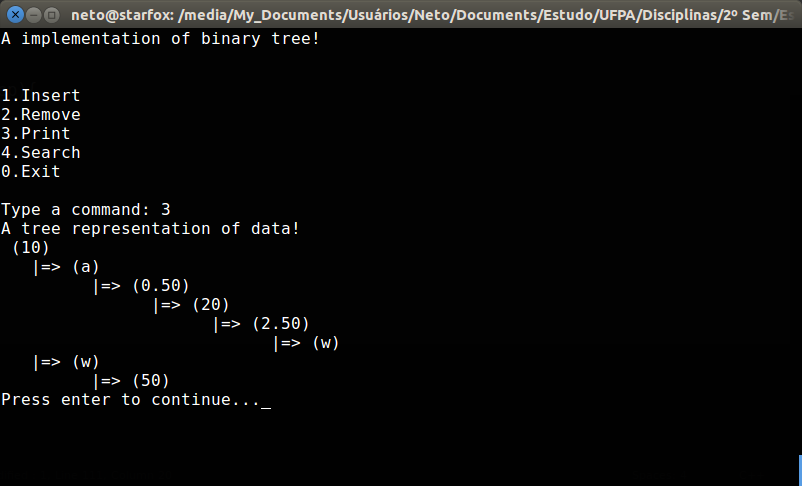

# tree-struct

An implementation of binary tree algorithms. And it's all written in ANSI C - or pretended to be.

## History

I'm creating a binary tree that include support to 3 types of data. They are:
  * `struct`
  * `union`
  * `enum`

+↑ **Updated**

Representing the binary tree below! See:



## Compiling and Using

It's very simple, on main directory only do this:
  * `make`
  * `./binary-tree.out`

## Credits

  * Me (Manoel Vilela)

## License

GPLv3

## Roadmap
  - [X] Create a binary tree structure
  - [X] Implement for any type: ```C
  char, int, float```
  - [ ] Methods
    - [X] Start 
    - [X] Insert 
    - [X] Remove      
    - [X] Edit 
    - [X] Search 
    - [X] Print 
    - [ ] Sort
    - [ ] Notation
      - [X] Prefix
      - [ ] Posfix
      - [ ] Infix
    - [ ] Balance
  - [X] Attributes
    - [X] Sum of nodes
    - [X] Sum of leafs
    - [X] Deepness
  - [X] A beautiful way to print output (I like the current representation)