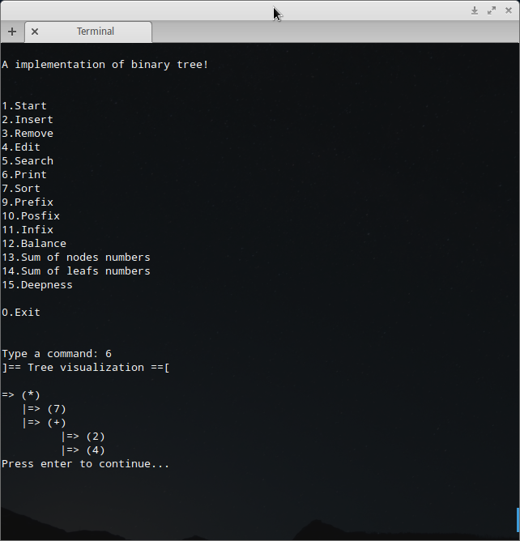

# tree-struct

Few implementations of tree algorithms. On beginning, trying to make a implementation on ANSI C. 

## History

I'm trying create a binary tree with a smart method to choose any type. 
Meta-type? To do so, attempting to us:
  * `struct`
  * `union`
  * `enum`

+↑ **Updated**

I did can something! See:




## Credits

  * Me (Manoel Vilela)

## License

GPLv3

## Roadmap
  - [X] Create a binary tree structure
  - [X] Implement for any type: ```C
  char, int, float```
  - [X] Insert method
  - [X] Search method
  - [ ] Remove method
  - [ ] Edit method
  - [X] A beautiful way to print output